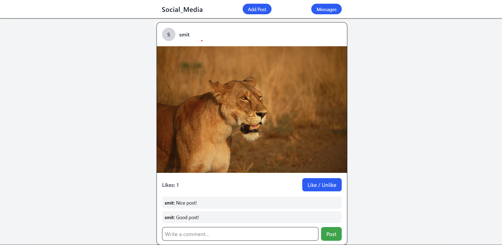
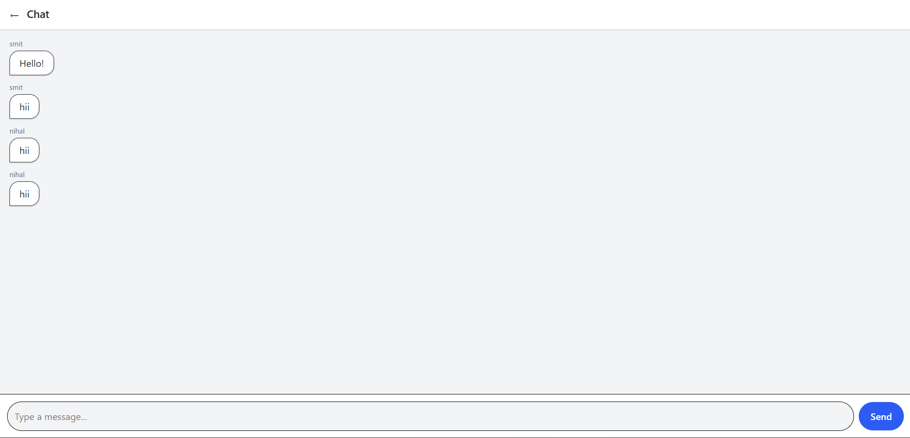

 Social Media Project (MERN) – README

A simple social media style project where users can sign up, log in, create posts with images (Cloudinary upload), like posts, and comment on them.
This project uses the MERN stack and demonstrates authentication, media upload, API integration, and basic user interaction.

 Features

 Authentication

User Signup
User Login
JWT-based authentication
Protected routes

 Posts

Create post with caption + image
Image stored on Cloudinary
Fetch all posts (Feed)
Display posts with user info

 Like System

Like / Unlike any post
Auto like toggle behavior

 Comment System

Add comments on any post
Multiple comments allowed per user
Stores commenter info

 Tech Stack
Layer	Technology
Frontend: React, React Router, Axios
Backend: Node.js, Express.js
Database: MongoDB + Mongoose
Auth: JWT
File Upload	Multer + Cloudinary
Styling: Tailwind / CSS

 Backend Installed Dependencies

The project uses the following packages:

Core Packages: express mongoose dotenv cors

Authentication: bcrypt jsonwebtoken

Media Upload: multer cloudinary multer-storage-cloudinary

Install all dependencies: npm install express mongoose dotenv cors bcrypt jsonwebtoken multer cloudinary multer-storage-c

 How to Run the Backend
1. Navigate to the backend folder
cd backend

2. Install dependencies
npm install

3. Start the server
If using Node:
node server.js

If using Nodemon:
npm install -g nodemon
nodemon server.js

Or use the script from package.json:
npm run dev

 Frontend Installed Dependencies

The project uses the following packages:

Core Packages: react react-dom

Routing: react-router-dom

API Handling: axios

Install all dependencies: npm install react-router-dom axios

 How to Run the Frontend
1. Navigate to the frontend folder
cd frontend

2. Install dependencies
npm install

3. Start the frontend
npm run dev

The app will run at: http://localhost:5173

Screenshots

Below are the main screens of the application for a quick visual overview.

Signup Page

Login Page

Home Feed

Full Home Page

Like Post
 

Add New Post Page
 

Posting New Post

All Chats Page

ChatBox Page

 Project Structure

project/
 ├── backend/
 │    ├── server.js
 │    ├── config/
 │    │     ├── db.js
 │    │     └── cloudinary.js
 │    ├── routes/
 │    │     ├── authRoutes.js
 │    │     └── postRoutes.js
 │    ├── controllers/
 │    │     ├── authController.js
 │    │     └── postController.js
 │    ├── middleware/
 │    │     ├── authMiddleware.js
 │    │     └── upload.js
 │    ├── models/
 │    │     ├── User.js
 │    │     └── Post.js
 │    └── .env
 │
 └── src/
     │
     ├── api/
     │    └── api.js
     │
     ├── components/
     │    └── ProtectedRoute.jsx
     ├── context/
     │    └── AuthProvider.jsx
     ├── pages/
     │    ├── Signup.jsx
     │    ├── Login.jsx
     │    ├── Feed.jsx
     │    └── CreatePost.jsx
     │
     ├── App.jsx
     ├── App.css
     └── main.jsx

🔗 API Endpoints

Auth
Method Route Description
POST: /api/auth/register  User Signup
POST: /api/auth/login  User Login
GET: /api/auth/me  Get logged user

Post
Method Route Description
POST: /api/post/create  Create post (caption + image)
GET: /api/post/all  Get all posts
PUT: /api/post/like/:id  Like / Unlike
POST: /api/post/comment/:id  Add comment